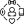
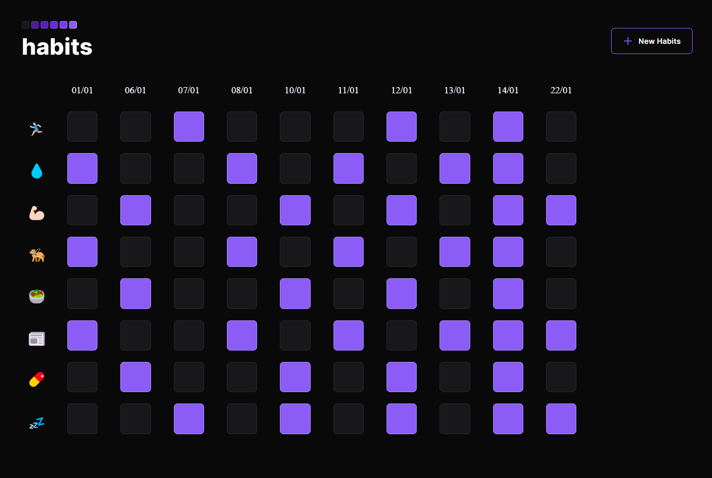

<h1 align="center"> 
  
  Habits
</h1>

NLW is an exclusive and free event, promoted by Rocketseat for teaching WEB technologies.  

  <a href="#-technologies">Technologies</a>&nbsp;&nbsp;&nbsp;|&nbsp;&nbsp;&nbsp;
  <a href="#-project">Project</a>&nbsp;&nbsp;&nbsp;|&nbsp;&nbsp;&nbsp;
  <a href="#-layout">Layout</a>&nbsp;&nbsp;&nbsp;|&nbsp;&nbsp;&nbsp;
  <a href="#memo-licença">License</a>

  

 

## 🚀 Technologies

This project was developed with the following technologies:

- HTML e CSS
- JavaScript
- Git e Github
- Figma

## 💻 Project

Habits is an app to help track habits.

- [Visite o projeto online](https://arks-lacerda.github.io/04-everydayHabitsExplorer/)

## 🔖 Layout

Project layout [FROM THIS LINK](https://www.figma.com/community/file/1195327109778210238). It is necessary to have an account on [Figma](https://figma.com) to access it.

## 📝 License

This project is licensed under the MIT license.

---

Done with ♥ by Arthur 👋
